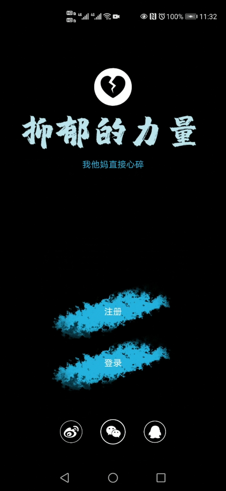
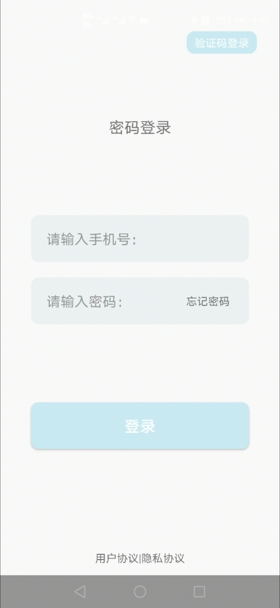
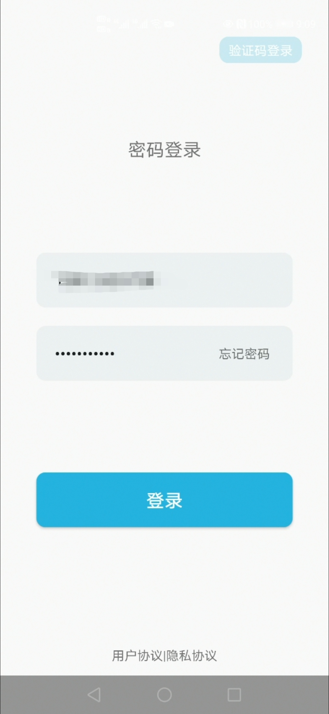
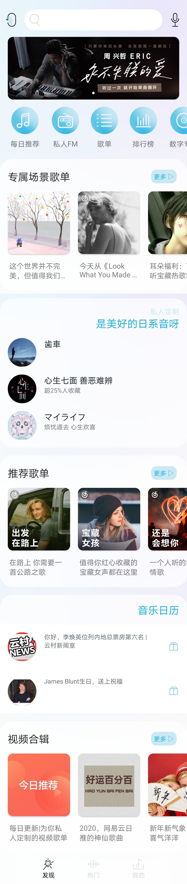
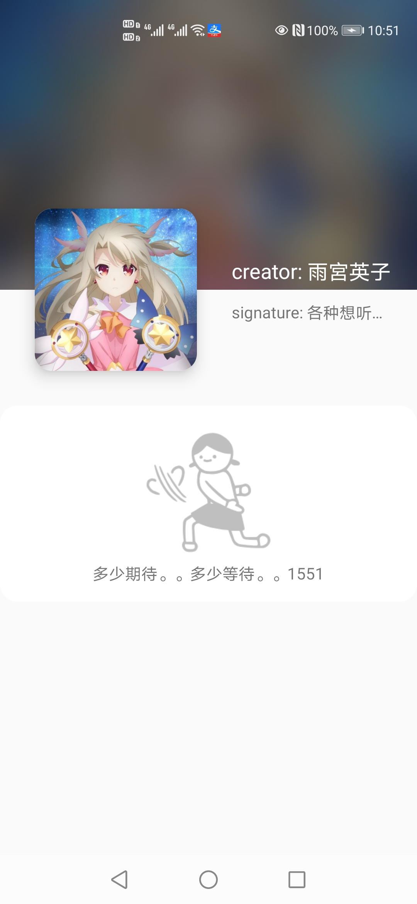
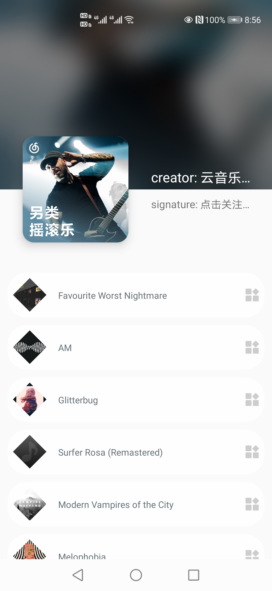
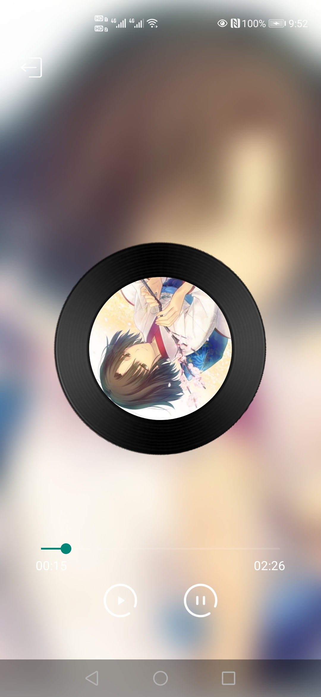
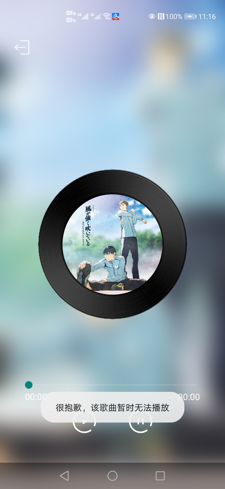

# NetDepression
## 介绍：
 由于做的是网抑云而不是网易云，所以本着让用户感到抑郁的开发宗旨，功能少到令人发指（狗头） 
## 功能：
 1.仅支持密码登录，登录后用户就可以看到自己美丽的头像和美丽的背景图
 2.仅三个碎片中显示的歌单支持点击
 3.仅首页左上角的刷新是有效的，其他ic都是摆设
 4.歌单里展示出来的歌，只要官方能放这边就也可以听
 5.时间实在来不及，其他功能后续会补 
## 优点：
 只有UI。着实花了一番心思，布局文件一直在改  最自豪的地方是用户头像那里的水波效果 
## 缺点：
 这也太多了，这么拉挎的app的缺点讲一天都讲不完，不仅没功能，bug还多 
## 设计思路：
 关于数据展示：主界面三个碎片中的数据展示使用MVP架构，由fragment通知presenter，再由presenter调用model中的网络请求和json解析方法
 关于音乐播放：PlayActivity作为前台，通过自定义binder控制MusicService，MediaPlayer相关的操作都在服务中完成
 关于用户界面：总之就是一定要好看，不改好看就不想往下做 
## 展示说明：
 不知道为什么mp4转gif之后就变得很慢，请耐心看哦
 启动和登录：
 
 
 
 个人信息界面数据展示：
 
 热门界面数据展示：
 
 
 发现界面数据展示：
 
 
 
 歌单详情：
 
 
 音乐播放：
 
 

